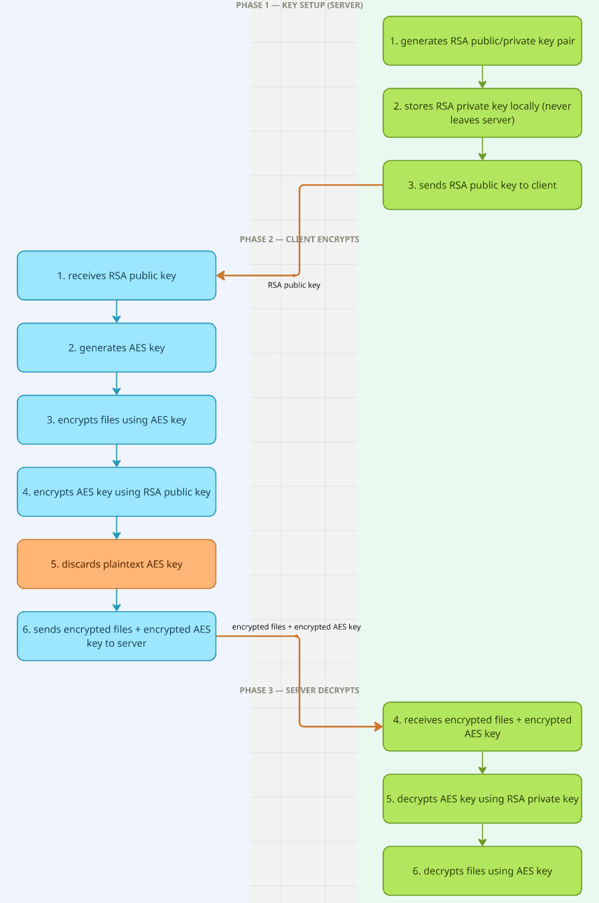

**Trojan Malware – file encryption**

This is for educational purposes only! I will not provide information on how to use it, or attack someone using this code, this is for educational purposes only and to learn

**What it does**

this is a trojan malware, it encrypts all of the victims files in a specific directory with the key only the server(attacker) able to access.

**Hybrid encryption**

The encryption flow for the malware includes 2 encryption algorithms: AES for encrypting the files, and RSA for a safe AES key exchange. AES is used to encrypt the files since it very fast, lightweight and also very easy to decrypt, while RSA solves the problem of the key exchange with asymmetric encryption.

**Flow chart of the project**

the project follows a precise flow to make sure it is secured and works well. Here is the flow.

**Server:**

1. generates RSA public/private key pair
2. stores RSA private key locally (never leaves server)
3. sends RSA public key to client

**client:**

1. receives RSA public key
2. generates AES key
3. encrypt the victim's files using the AES key
4. encrypts AES key using the public RSA key
5. discards plaintext AES key
6. sends encrypted AES key to server

**server:**

4. receives encrypted AES key
5. decrypts AES key using RSA private key=

**local storage**

as mentioned in the flow, we save the RSA private keys locally, however this isn't the only thing we are storing. For every attack we store her own file, in a new file that is created in the project. Each file is built this way by lines:

1. RSA private key
2. RSA public key
3. AES key
4. Username of the victim

The username of the victim is basically his username on his windows account.

**Attack destination**

as of now the project directs to Desktop,Downloads,Pictures,Videos,Music folders on the victim's computer.
